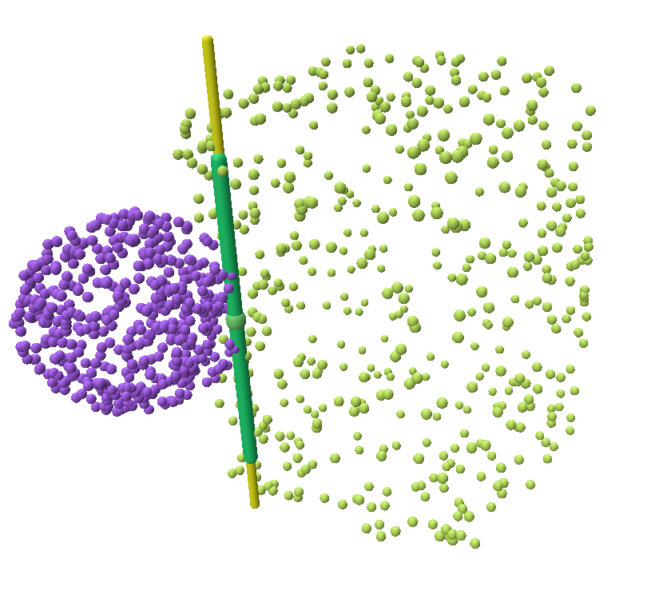

# Evaluation

This project performs joint analysis research based on the ParaHome dataset, containing implementations and evaluations of various joint estimation methods. The project is divided into two main parts: **Slide version** and **Thesis version**, which employ different code implementations and different data extracted form ParaHome.

## Dataset Location

**ParaHome Dataset**: `/common/datasets/users/gao/kvil/art_kvil/ma_rui/`

This dataset contains joint motion data for various household objects, supporting the following joint types:
- `prismatic` - Translational joints (e.g., drawers)
- `revolute` - Rotational joints (e.g., doors, microwaves)
- `planar` - Planar joints (e.g., chairs)

## Project Structure

```
evaluation/
├── my_evaluation_slide.py              # Slide version: My method single-file visualization
├── my_evaluation_thesis.py             # Thesis version: My method single-file visualization
├── my_evaluation_slide_batch.py        # Slide version: My method batch evaluation
├── evaluation_sturm.py                 # Sturm method single-file visualization
├── evaluation_sturm_slide_batch.py     # Slide version: Sturm method batch evaluation
├── evaluation_martin_thesis.py         # Thesis version: Martin method visualization
├── evaluation_martin_slide_batch.py    # Slide version: Martin method batch evaluation
└── result_slide/                       # Slide version results directory
└── result_thesis/                      # Thesis version results directory
```

## Method Description

### 1. My Method
- Based on the joint_analysis module
- Supports recognition and parameter estimation for multiple joint types

### 2. Sturm Method
- Probabilistic model-based joint estimation
- Uses BIC criterion for model selection
- Includes Rigid, Prismatic, and Revolute models

### 3. Martin Method
- Joint analysis based on spatial twists
- Uses EKF for joint classification
- Supports real-time probability estimation
- Not implemented joint parameter estimation

## Environment Setup

```bash
```

## Reproduction Guide

### Slide Version Reproduction

#### 1. Single-file Visualization Testing

**My Method:**
```bash
cd evaluation/
python my_evaluation_slide.py
```
It will open a Polyscope GUI, xxxx TODO

**Sturm Method:**
```bash
python -m evaluation_sturm
```

**Martin Method:**
```bash
python -m evaluation_martin_thesis
```

#### 2. Batch Evaluation

**My Method Batch Evaluation:**
```bash
python my_evaluation_slide_batch.py
```
- Output: `joint_analysis_evaluation_noise_0p01_YYYYMMDD_HHMMSS.json`

**Sturm Method Batch Evaluation:**
```bash
python -m evaluation_sturm_slide_batch
```
- Output: `sturm_joint_analysis_evaluation_noise_0p01_YYYYMMDD_HHMMSS.json`

**Martin Method Batch Evaluation:**
```bash
python -m evaluation_martin_slide_batch
```
- Output: `martin_joint_analysis_evaluation_noise_0p01_YYYYMMDD_HHMMSS.json`

### Thesis Version Reproduction



#### Single-file Visualization Testing
```bash
python my_evaluation_thesis.py
```

## Parameter Configuration

### Dataset Configuration
```python
# Dataset directory
directory_path = "/common/datasets/users/gao/kvil/art_kvil/ma_rui/"

# Target object types
target_objects = ["drawer", "washingmachine", "trashbin", "microwave", "refrigerator", "chair"]

# Expected joint type mapping
expected_joint_types = {
    "drawer": "prismatic",
    "microwave": "revolute", 
    "refrigerator": "revolute",
    "washingmachine": "revolute",
    "trashbin": "revolute",
    "chair": "planar"
}
```

### Noise Testing Configuration
```python
# Gaussian noise standard deviation
noise_levels = [0.01]  # Can be modified to [0.0, 0.005, 0.01, 0.02]
```

### Joint Analysis Parameters (My Method)
```python
# Number of neighbors
num_neighbors = 50

# Collinearity parameters
col_sigma = 0.6
col_order = 4.0

# Coplanarity parameters  
cop_sigma = 0.6
cop_order = 4.0

# Radius consistency parameters
rad_sigma = 0.55
rad_order = 4.0

# Zero pitch parameters
zp_sigma = 0.8
zp_order = 4.0

# Savitzky-Golay filter
use_savgol = True
savgol_window = 21
savgol_poly = 2
```

## Results Analysis

### Output File Format

Each evaluation generates a JSON format result file containing:

```json
{
  "evaluation_timestamp": "ISO timestamp",
  "method": "Method name",
  "noise_std": 0.01,
  "overall_statistics": {
    "total_groups": "Total number of groups",
    "successful_groups": "Number of successful groups",
    "overall_success_rate": "Overall success rate"
  },
  "object_statistics": {
    "drawer": {
      "total_groups": "Total drawer groups",
      "successful_groups": "Successful drawer groups",
      "success_rate": "Drawer success rate",
      "average_angle_error": "Average angle error",
      "average_distance_error": "Average distance error"
    }
    // ... other object types
  },
  "detailed_group_results": ["Detailed results list"]
}
```

### Evaluation Metrics

1. **Classification Accuracy**: Proportion of correctly identified joint types
2. **Angle Error**: Angular difference between estimated and true axes (degrees)
3. **Distance Error**: Distance between estimated and true axes (meters)
4. **Success Rate**: Classification success rate by object type

## Visualization Features

### Polyscope Interface Operations

When running single-file visualization, the Polyscope 3D visualization interface opens:

1. **Time Control**: Use "Time Frame" slider to browse time series
2. **Point Cloud Selection**: Use "Point Index" slider to select specific points
3. **Dataset Switching**: Select different datasets in "Dataset Selection"
4. **Ground Truth Comparison**: Check "Show Ground Truth" to display real joint axes
5. **Parameter Adjustment**: Real-time algorithm parameter adjustment in "Joint Analysis Parameters"
6. **Result Saving**: Click "Save Current Plot" to save current charts

### Joint Visualization

- **Prismatic joints**: Cyan line segments represent translation axes
- **Revolute joints**: Yellow line segments represent rotation axes, red points represent rotation centers
- **Ground truth**: Green line segments represent true joint axes
- **Point clouds**: Colored point clouds represent object surface points

## Troubleshooting

### Common Issues

1. **Import Errors**: Ensure all dependencies are correctly installed
2. **Path Errors**: Check if dataset path is correct
3**Visualization Issues**: Ensure display environment supports OpenGL

### Debugging Suggestions

1. Run single-file visualization first to ensure environment is working
2. Check dataset directory structure and filename formats
3. Review detailed error messages in console output
4. Adjust algorithm parameters as needed

## Expected Results

Based on project settings, expected success rates are approximately:

- **Drawer (Prismatic)**: 80-90%
- **Microwave/Refrigerator/Washing Machine (Revolute)**: 70-85%  
- **Chair (Planar)**: 60-80%

Result files are saved in:
- **Slide version**: `result_slide/` directory
- **Thesis version**: `result_thesis/` directory

## Contact Information

For questions, please check code comments or contact project maintainers.

## Additional Notes

### Data File Naming Convention
The dataset files follow this naming pattern:
```
s{scene_id}_{object_type}_{part}_{start_frame}_{end_frame}.npy
```
Example: `s204_drawer_part2_1320_1440.npy`

### Ground Truth Data
Ground truth joint information is stored in:
```
/common/homes/all/uksqc_chen/projects/control/ParaHome/all_scenes_transformed_axis_pivot_data.json
```

### Noise Robustness Testing
The evaluation supports adding Gaussian noise to test algorithm robustness:
- Standard deviations: 0.0 (no noise), 0.005, 0.01, 0.02
- Noise is added to point cloud coordinates before processing

### Performance Optimization
For large-scale evaluations:
- Consider running on high-memory machines
- Adjust `num_neighbors` parameter for speed vs. accuracy trade-off
- Use parallel processing for batch evaluations when possible